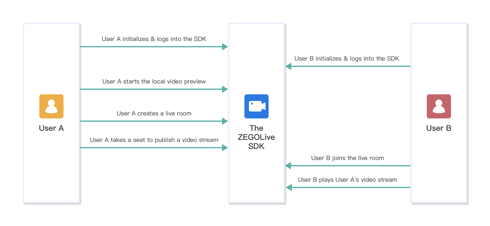
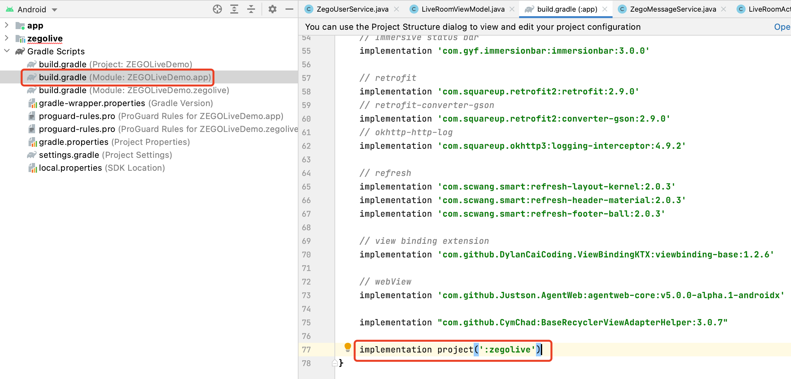
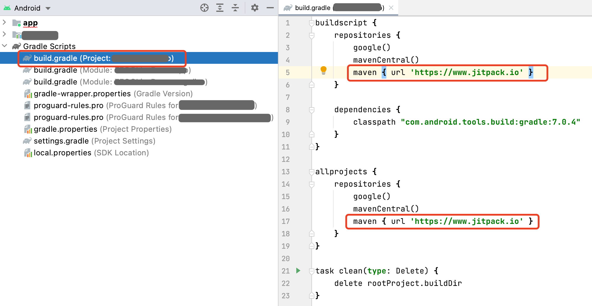
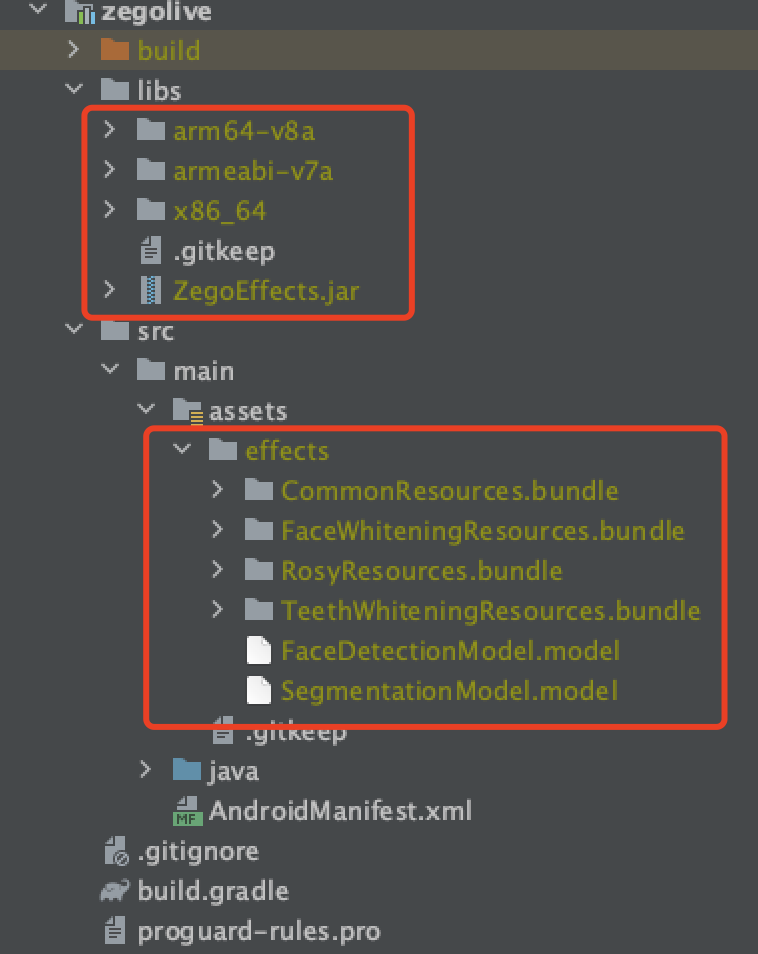

# Build a live video streaming

- - -

ZEGO Live provides you the capability to build an interactive live streaming application by encapsulating the Express-Video SDK, ZIM SDK, and ZegoEffects SDK. This document describes how to build a live video streaming with the ZEGO Live SDK.

<br>
<br>

---

## Prerequisites

* Contact us to activate the ZEGO Live service, get the ZegoEffects SDK, and the resources and models that are required.
* Create a project in [ZEGO Admin Console](https://console.zegocloud.com/). For details, see [ZEGO Admin Console - Project management](https://docs.zegocloud.com/article/1271).

## Understand the process 

The following diagram shows the basic process of creating a live room and a participant (user B) playing a stream published by the host (user A).



## Integrate the ZEGOLive SDK
 
<div class="mk-warning" style="background: #fafbfc;border: 1px solid #ff8830;border-radius: 4px;border-top-width: 4px;padding: 20px 20px 6px 20px;"><div style="color: #ff8830;">⚠️ Caution:</div>

The Server APIs that we used to implement live room related business logic in the ZEGO Live sample app are only for experience and debugging purposes.

To build your own live streaming app, you can refer to ours to design your own business server APIs and replace them in our sample code. For more details about those Server APIs, see [Room related Server APIs](https://docs.zegocloud.com/article/13861).

</div>

To integrate the SDK, do the following:

1. Download the Sample codes, copy the `zegolive` module to your project.
2. Add the following code to the `settings.gradle` file:
    
    ```gradle
    include ':zegolive'
    ```

3. Modify the `build.gradle` file of your application, add the following code to the `dependencies` node: 

    ```gradle
    implementation project(':zegolive')
    ```
    

4. Modify the `build.gradle` file of your project, add the following code to the `repositories` node: 

    ```gradle
    maven { url 'https://www.jitpack.io' }
    ```
    

5. Put the **ZegoEffects SDK** you get in the previous step into the `zegolive/libs` file, and put the **resources**, and **models** into the `zegolive/src/main/assets/effects` file.
    
        


6. Click `sync now`.

## Add permissions

Permissions can be set as needed.

Open the file `app/src/main/AndroidManifest.xml`, and add the following code:


```xml
<!-- Permissions required by the SDK -->
    <uses-permission android:name="android.permission.ACCESS_WIFI_STATE" />
    <uses-permission android:name="android.permission.RECORD_AUDIO" />
    <uses-permission android:name="android.permission.INTERNET" />
    <uses-permission android:name="android.permission.ACCESS_NETWORK_STATE" />
    <uses-permission android:name="android.permission.CAMERA" />
    <uses-permission android:name="android.permission.BLUETOOTH" />
    <uses-permission android:name="android.permission.MODIFY_AUDIO_SETTINGS" />
    <uses-permission android:name="android.permission.WRITE_EXTERNAL_STORAGE" />

    <!-- Permissons required by the App -->
    <uses-permission android:name="android.permission.READ_PHONE_STATE" />
    <uses-permission android:name="android.permission.WAKE_LOCK" />

    <uses-feature
        android:glEsVersion="0x00020000"
        android:required="true" />

    <uses-feature android:name="android.hardware.camera" />
    <uses-feature android:name="android.hardware.camera.autofocus" />
```

> Note: For Android 6.0 or later, some important permissions must be requested at runtime rather than declared statically in the file `AndroidMainfest.xml`, therefore, you need to add the following code to do so (requestPermissions is a method of an Android Activity).

```java
String[] permissionNeeded = {
        "android.permission.CAMERA",
        "android.permission.RECORD_AUDIO"};

if (Build.VERSION.SDK_INT >= Build.VERSION_CODES.M) {
    if (ContextCompat.checkSelfPermission(this, "android.permission.CAMERA") != PackageManager.PERMISSION_GRANTED ||
        ContextCompat.checkSelfPermission(this, "android.permission.RECORD_AUDIO") != PackageManager.PERMISSION_GRANTED) {
        requestPermissions(permissionNeeded, 101);
    }
}
```

## Initialize the ZEGOLive SDK 

To initialize the ZEGOLive SDK, get the `RoomManager` instance, pass the AppID and AppSign of your project. 

```java
// The AppID you get from ZEGOCLOUD Admin Console. 
long appID = 214124124L;
// The AppSign you get from ZEGOCLOUD Admin Console. 
String appSign = "xxx";
// Initialize the SDK. We recommend you call this method when the application starts.
// The last parameter refers to the Application object of the ZEGOlive SDK.
ZegoRoomManager.getInstance().init(appID, appSign, this);
```

To receive event callbacks, call the `setListener` to listen for and handle various events as needed.

```java
ZegoMessageService messageService = ZegoRoomManager.getInstance().messageService;
messageService.setListener(new ZegoMessageServiceListener() {
    // Implement the callback handling logic as needed.
});

ZegoUserService userService = ZegoRoomManager.getInstance().userService;
userService.setListener(new ZegoUserServiceListener() {
    // Implement the callback handling logic as needed.        
});

ZegoRoomService roomService = ZegoRoomManager.getInstance().roomService;
roomService.setListener(new ZegoRoomServiceListener() {
    // Implement the callback handling logic as needed. 
});
```

## Log in 

To access the ZEGOLive service, you must log in first.

```java
ZegoUserInfo user  = new ZegoUserInfo();
// Set the user related properties. 
user.setUserID("USER_ID");
user.setUserName("USER_NAME");

// The ZIM token. 
String token = "xxx";  
ZegoRoomManager.getInstance().userService.login(user, token, new ZegoRoomCallback() {
    @Override
    public void onRoomCallback(int errorCode) {
        // Callback for the login result. 
    }
});
```

## Start the local video preview

Before creating a live room to start live streaming, you can call the `playVideoStream` method to start the local video preview.

```java
// The [userID] can be used to specify which user's view you want to view. 
// To preview your own local video view, pass in your userID.
// streamView view is a view for the local video preview.
ZegoRoomManager.getInstance().deviceService.playVideoStream(userID, streamView);
```

## Create/Join a live room

- You become a **Host** after creating a room, and you can take a seat and start live streaming upon creating.
- You become a **Participants** after joining a live room, and you can watch the live streaming and be a [co-host](https://docs.zegocloud.com/article/13824) to interact.


<div class="mk-warning" style="background: #fafbfc;border: 1px solid #ff8830;border-radius: 4px;border-top-width: 4px;padding: 20px 20px 6px 20px;"><div style="color: #ff8830;">⚠️ Caution:</div>

- To prevent listeners in a room from being able to speak directly without taking a speaker seat, you will need to provide a token for the RTC SDK to validate whether you have the privileges to create or join a room. To obtain the token, see [RTC - Control user privileges](https://docs.zegocloud.com/article/11649). 
  
</div>

To create a live room, call the `createRoom` method: 

```java
String roomID = "YOUR_ROOM_ID";
String roomName = "YOUR_ROOM_NAME";
String rtcToken = "xxx";  // The RTC token. 
ZegoRoomManager.getInstance().roomService.createRoom(roomID, roomName, rtcToken, new ZegoRoomCallback() {
   @Override
   public void onRoomCallback(int errorCode) {
   // Callback for the result of create a live room. 
   }
});
```

After a live room is created, to start live streaming, the host will need to call the `takeSeat` method to speak. And the SDK automatically publishes the streams when the host takes a seat successfully.

```java
ZegoRoomManager.getInstance().userService.takeSeat(new ZegoRoomCallback(){
   @Override
   public void onRoomCallback(int errorCode) {
   // Callback for the returned result of take a seat.
   }
});
```

To join a live room, call the `joinRoom` method. 

```java
String roomID = "ROOM_ID";
String rtcToken = "xxx";  // The RTC token. 
ZegoRoomManager.getInstance().roomService.joinRoom(roomID, rtcToken, new ZegoRoomCallback() {
   @Override
   public void onRoomCallback(int errorCode) {
   // Callback for the result of join a live room. 
   }
});
```

After joining a live room, for a participant to watch the live streaming, he will need to call the `playVideoStream` method to play the host's published streams. 

```java
// The [userID] can be used to specify which user's view you want to view. 
// You can get the userID of the host in room info.
// streamView view is a view for the local video preview.
ZegoRoomManager.getInstance().deviceService.playVideoStream(userID, streamView);
```

## Send/Receive text chat messages

To send text chat messages in the room, call the `sendTextMessage` method.

```java
ZegoRoomManager.getInstance().messageService.sendTextMessage("YOUR_MESSAGE", new ZegoRoomCallback() {
   @Override
   public void onRoomCallback(int errorCode) {
   // Callback for the result of send a message.
   }
});
```
    
To receive the text chat messages, listen for the callback `onReceiveTextMessage`.

```java
ZegoRoomManager.getInstance().messageService.setListener(new ZegoMessageServiceListener() {
    @Override
    public void onReceiveTextMessage(ZegoTextMessage textMessage) {
        // Receives and handle the messages (messages and sender ID).   
    }
});
```

## Leave a live room

Before the host leaves the live room, he will need to call the `leaveSeat` to leave the seat first. And the SDK automatically stops publishing streams when the host leaves the seat successfully.

```java
ZegoRoomManager.getInstance().userService.leaveSeat(new ZegoRoomCallback(){
   @Override
   public void onRoomCallback(int errorCode){
   // Callback for the result of leave a seat.
   }
});
```

To leave the live room, call the `leaveRoom` method. And the SDK stops all the stream publishing and playing operations simultaneously.    

```java
ZegoRoomManager.getInstance().roomService.leaveRoom(new ZegoRoomCallback() {
   @Override
   public void onRoomCallback(int errorCode) {
   // Callback for the result of leave a live room. 
   }
});
```

## Log out

To finish the ZEGOLive service, call the `logout` method.

```java
ZegoRoomManager.getInstance().userService.logout();
```

## Deinitialize the ZEGOLive SDK

To deinitialize the SDK to make it uninitialized, call the `uninit` method. 

```java
ZegoRoomManager.getInstance().unInit();
```


## FAQ

**Question**: The error `Lambda expressions are not supported at language level '7'` occurs after importing the `zegolive` module. 

**Answer**: Lambda expressions are only supported in Java 8 or later. You will need to add the following code into the `build.gradle` file of your project first:

```gradle
android {
    ...
    // Configure only for each module that uses Java 8
    // language features (either in its source code or
    // through dependencies).
    compileOptions {
        sourceCompatibility JavaVersion.VERSION_1_8
        targetCompatibility JavaVersion.VERSION_1_8
    }
}
```
