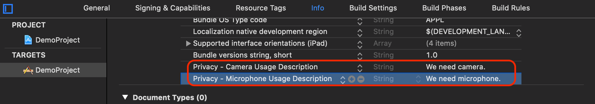

# Build a live video streaming

- - -

ZEGO Live provides you the capability to build an interactive live streaming application by encapsulating the Express-Video SDK, ZIM SDK, and ZegoEffects SDK. This document describes how to build a live video streaming with the ZEGO Live SDK.

<br>
<br>

---

## Prerequisites

* Contact us to activate the ZEGO Live service, get the ZegoEffects SDK, and the resources and models that are required.
* Create a project in [ZEGO Admin Console](https://console.zegocloud.com/). For details, see [ZEGO Admin Console - Project management](https://docs.zegocloud.com/article/1271).


## Understand the process 

The following diagram shows the basic process of creating a live room and a participant (user B) playing a stream published by the host (user A).


## Integrate the ZEGOLive SDK

<div class="mk-warning" style="background: #fafbfc;border: 1px solid #ff8830;border-radius: 4px;border-top-width: 4px;padding: 20px 20px 6px 20px;"><div style="color: #ff8830;">⚠️ Caution:</div>

The Server APIs that we used to implement live room related business logic in the ZEGO Live sample app are only for experience and debugging purposes.

To build your own live streaming app, you can refer to ours to design your own business server APIs and replace them in our sample code. For more details about those Server APIs, see [Room related Server APIs](https://docs.zegocloud.com/article/13860).

</div>


To integrate the SDK, do the following:

1. Download the Sample codes, and copy the `ZEGOLive` folder to your project directory. 
2. Add the `Podfile` file to your project directory.


3. Open Terminal, run the `install` command. 

```
pod install
```

4. Put the ZegoEffects SDK dynamic library, resources, and models you get in the previous step into your project directory.
5. In Xcode, select **File > Add Files to "xxx" (your project name)**, and add the **ZegoEffects SDK**, **resources**, and **models** into the project.
6. Select **TARGETS > General > Frameworks,Libraries,and Enbedded Content**, add the `ZegoEffects.xcframework`, and then set the **Embed** to **Embed & Sign**.
7. Select **TARGET > General > Deployment Info**, set it to version 13.0 or later.

## Add permissions

Permissions can be set as needed.

1. Open Xcode, select the target object, and then click **Info > Custom iOS Target Properties**.
2. Click the **Add button (+)** to add camera and microphone permissions.  
    

## Initialize the ZEGOLive SDK 

To initialize the ZEGOLive SDK, get the `RoomManager` instance, pass the AppID and AppSign of your project. 

```swift
// Initialize the SDK. We recommend you call this method when the application starts.
// YOUR_APP_ID is the AppID you get from ZEGO Admin Console. 
// YOUR_APP_SIGN is the AppSign you get from ZEGO Admin Console. 
RoomManager.shared.initWithAppID(appID: YOUR_APP_ID, appSign: YOUR_APP_SIGN) { result in
    // Callback for the result of init. 

};
```

To receive callbacks, set the corresponding `delegate` to `self`, or call the `addUserServiceDelegate` method to listen for and handle event callbacks as needed.


```swift
RoomManager.shared.roomService.delegate = self
RoomManager.shared.userService.addUserServiceDelegate(self)
RoomManager.shared.messageService.delegate = self
```

## Set the resource path 

Before implementing the face beautify feature, you will need to put the required resource files to the ZegoEffects SDK. To do so, call the following method and put the path of the resource into it. 

```swift
let resourcePaths = ["xxx.model", "xxx.bundle"]   
RoomManager.shared.beautifyService.setResources(resourcePaths)
```

## Log in 

To access the ZEGOLive service, you must log in first.

```swift
let userInfo = UserInfo("YOUR_USER_ID", "YOUR_USER_NAME", .participant)
let token: String = "YOUR_ZIM_TOKEN"
RoomManager.shared.userService.login(userInfo, token) { result in  
     // Callback for the login result. 

}
```

## Start the local video preview

Before creating a live room to start live streaming, you can call the `playVideoStream` method to start the local video preview.

```swift
// The [userID] can be used to specify which user's view you want to view. 
// To preview your own local video view, pass in your userID.
// streamView view is a view for the local video preview.
RoomManager.shared.deviceService.playVideoStream(userID, view: streamView)
```

## Create/Join a live room

- You become a **Host** after creating a live room, and you can take a seat and start live streaming upon creating.
- You become a **Participants** after joining a live room, and you can watch the live streaming and be a [co-host](https://docs.zegocloud.com/article/13823) to interact.


To create a live room, call the `createRoom` method.  

```swift
let rtcToken: String = "YOUR_RTC_TOKEN"
RoomManager.shared.roomService.createRoom("YOUR_ROOM_ID", "YOUR_ROOM_NAME", rtcToken) { result in
    // Callback for the result of create a live room. 
           
}
```

After a live room is created, to start live streaming, the host will need to call the `takeSeat` method to speak. And the SDK automatically publishes the streams when the host takes a seat successfully.


```swift
RoomManager.shared.userService.takeSeat { result in
   // Callback for the result of take a seat. 

}
```

To join a live room, call the `joinRoom` method. 

```swift
let rtcToken: String = "YOUR_RTC_TOKEN"
RoomManager.shared.roomService.joinRoom("YOUR_ROOM_ID", rtcToken) { result in
   // Callback for the result of join a live room. 

}
```


After joining a live room, for a participant to watch the live streaming, he will need to call the `playVideoStream` method to play the host's published streams. 

```swift
// The [userID] can be used to specify which user's view you want to view. 
// You can get the userID of the host in room info. 
// streamView is the view to be displayed.
RoomManager.shared.deviceService.playVideoStream(userID, view: streamView)
```

## Send/Receive text chat messages

To send text chat messages in the room, call the `sendTextMessage` method.

```swift
RoomManager.shared.messageService.sendTextMessage("MESSAGE_CONTENT") { result in
    // The result of send messages. 
}
```
    
To receive the text chat messages, listen for the callback `receiveTextMessage`.

```swift
func receiveTextMessage(_ message: TextMessage) {
    // Implement the handling logic when receiving the text messages.
}
```

## Leave a live room


Before the host leaves the live room, he will need to call the `leaveSeat` to leave the seat first. And the SDK automatically stops publishing streams when the host leaves the seat successfully.


```swift
RoomManager.shared.userService.leaveSeat { Result in
     // Callback for the result of leave a seat. 
}
```

To leave the live room, call the `leaveRoom` method. And the SDK stops all the stream publishing and playing operations simultaneously.    

```swift
RoomManager.shared.roomService.leaveRoom { Result in
     // Callback for the result of leave a live room. 
}
```

## Log out

To finish the ZEGOLive service, call the `logout` method.

```swift
RoomManager.shared.userService.logout()
```

## Deinitialize the ZEGOLive SDK

To deinitialize the SDK to make it uninitialized, call the `uninit` method. 


```swift
RoomManager.shared.uninit()
```
